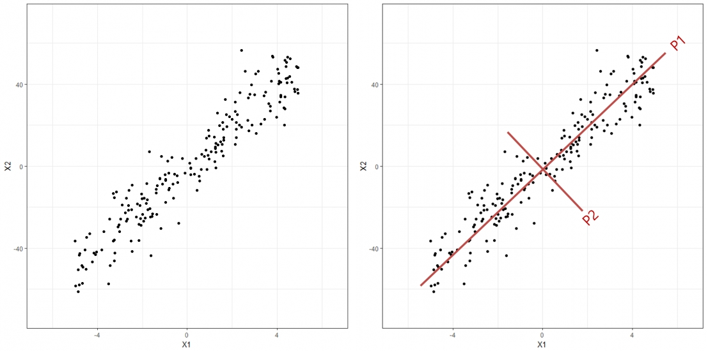
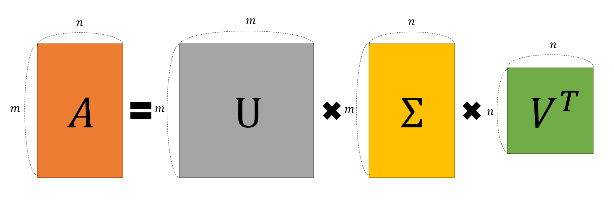
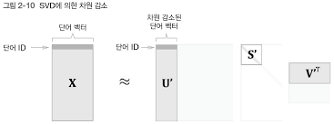

# 2. 자연어와 단어의 분산 표현

## 2.1 자연어 처리란

자연어: 한국어와 영어 등 평소에 우리가 쓰는 말
자연어 처리(NLP): 자연어를 컴퓨터가 이해시킬 수 있도록 하는 것

### 2.1.1 단어의 의미

단어의 의미를 잘 표현할 수 있는 방법

* 시소러스를 활용한 기법
* 통계 기반 기법
* 추론 기반 기법

## 2.2 시소러스

시소러스: 유의어 또는 동의어를 한 그룹으로 묶어둔 사전

예) car = auto, automobile, machine, motocar

단어 사이의 상하관계 (상의어/하의어) 혹은 전체와 부분 등 더 다양한 단어 사이의 관계까지 정의해둔 경우도 있음

### 2.2.1 WordNet

프린스턴 대학교에서 제작한 가장 유명한 시소러스

### 2.2.2 시소러스의 문제점 

WordNet과 같은 시소러스를 사용하면 간접적으로 컴퓨터에게 자연어의 의미를 전달할 수 잇으나 아래와 같은 문제들이 있다.

* 시대 변화에 대응하기 어렵다. 

    - 우리가 사용하는 언어는 시간에 따라 끊임없이 변화한다. 더이상 사람들이 사용하지 않는 단어가 발생하기도 하고 신조어가 만들어지기도 한다. 시소러스를 이용한 방법은 이런 단어의 시간적 변화에 대응하기 어렵다.

* 사람을 쓰는 비용이 크다.

    - 시소러스를 만드는 데는 많은 인적 비용이 필요하다. 현존하는 영단어의 수는 1000만개가 넘는데 이러한 단어들을 모두 포함하는 시소러스를 만들기 위해서는 엄청난 인적 비용이 필요할 것이다.

* 단어의 미묘한 차이를 표현할 수 없다.

    - 비슷한 단어들을 전부 한 묶음으로 묶어버리면 미묘한 차이를 반영하기 어렵다. 빈티지와 레트로 사이의 미묘한 차이를 우리는 느낄 수 있지만, 시소러스로는 이러한 차이를 반영하기 어렵다.

이러첨 시소러스를 사용하는 방법은 문제가 있다. 이 문제를 해결하기 위해 등장한 방법이 통계 기반 기법과 추론 기반 기법이다. 

## 2.3 통계 기반 기법

말뭉치(Corpus): 대량의 텍스트 데이터. 주로 자연어처리 연구나 앱 개발을 목적으로 모아둔 텍스트 데이터를 말뭉치라고 한다.

* corpus를 만들 때에는 품사와 같이 텍스틑에 대한 추가 정보를 태깅해서 제공하기도 한다. (품사태깅)

### 2.3.1 파이썬으로 말뭉치 처리하기

```python
text = "You say goodbye and I say hello."
```

실제 말뭉치에는 위와 같은 문장들이 무수히 많이 담겨있다. 이렇게 제공된 문장에 어떠한 전처리를 할 수 있을까?

```python
text = text.lower()
text = text.replace('.', ' .')
>>> text
'you say goodbye and i say hello .'
```

```python
words = text.split(' ')
words
>>> words
['you', 'say', 'goodbye', 'and', 'i', 'say', 'hello', '.']
```

* 모든 대문자를 소문자로 바꾸고, 마침표를 분리해내기 위해 '.'을 ' .'으로 바꾼 뒤 공백으로 split하면 모든 단어들이 담긴 리스트를 얻을 수 있다.
* 마침표 앞에 공백을 넣은 방법 말고 정규 표현식을 이용하는 방법이 더 널리 쓰인다.

물론 단어를 텍스트 그대로도 활용할 수 있겠으나, 불편할 수 있다. 따라서 단어마다 ID를 부여하고, 파이썬 딕셔너리로 이를 관리하도록 할 수 있다. 

```python
word_to_id = {}
id_to_word = {}

for word in words:
    if word not in word_to_id:
        new_id = len(word_to_id)
        word_to_id[word] = new_id
        id_to_word[new_id] = word
```

이런 식으로 구성해 놓으면 ```word_to_id``` 딕셔너리의 키는 ID, 밸류는 word가 되어 ID를 통해 단어를 찾아낼 수 있고, ```id_to_word```는 반대로 작동한다.

이제 파이썬의 Comprehension 기능을 활용하여 corpus를 만들자. corpus는 말뭉치 단어의 모든 ID가 담겨있는 넘파이 리스트이다.

```python
import numpy as np
corpus = [word_to_id[w] for w in word]
corpus = np.array(corpus)
>>> corpus
array([0, 1, 2, 3, 4, 1, 5, 6])
```

앞서 말한 모든 기능을 수행할 수 있는 ```preprocess``` 함수를 정의하자 

```python
def preprocess(text):
    text = text.lower()
    text = text.replace('.', ' .')
    words = text.split(' ')
    word_to_id = {}
    id_to_word = {}
    for word in words:
        if word not in word_to_id:
            new_id = len(word_to_id)
            word_to_id[word] = new_id
            id_to_word[new_id] = word
    corpus = np.array([word_to_id[w] for w in words])

    return corpus, word_to_id, id_to_word
```

### 2.3.2 단어의 분산 표현

분산 표현: 단어의 의미를 벡터로서 표현해낼 수 있는 방법

* 단어의 분산 표현은 단어를 고정 길이의 밀집 벡터(dense vector)로 표현한다. 밀집 벡터는 대부분의 원소가 0이 아닌 실수인 벡터이다.

### 2.3.3 분포 가설 

> 분포 가설: 단어의 의미는 주변 단어에 의해 형성된다.

즉, 다시 말해 단어의 의미는 그 단어 자체의 의미 뿐만 아니라 문맥(context) 안에서 더욱 구체화된다는 것이다. 

* Window(윈도우): 문장에서 맥락을 나타내주는 주변 단어의 수

예를 들어 아래 문장

#### you say goodbye and i say hello.
에서 goodbye라는 단어를 중심으로 윈도우 크기가 2인 맥락 묶음을 추출하면 ```[you, say, and, i]```가 되는 것이다.

상황에 따라서는 양 옆으로 2단어 씩이 아니라 왼쪽으로만, 또는 오른쪽으로만으로도 추출할 수 있다.

### 2.3.4 동시 발생 행렬

통계 기반 방법으로서 아래와 같은 방법을 이용하자

> 어떤 단어를 중심으로 그 주면에 어떤 단어가 몇 번 등장하는지 세어보자

예를 들어 ```you```를 중심 단어로 하여 주변 단어의 빈도를 세면 아래와 같아. 

||you|say|goodbye|and|i|hello|.|
|:---:|:---:|:---:|:---:|:---:|:---:|:---:|:---:|
|you|0|1|0|0|0|0|0|

이를 바탕으로 ```you```의 동시 발생 행렬 벡터는 ```[0, 1, 0, 0, 0, 0, 0]```이라는 벡터로 나타낼 수 있다.

계속해서 ID 1~5에 해당하는 나머지 단어들도 벡터로 표현할 수 있다. 

물론 해당 방식을 사용해 모든 단어의 동시 발생 행렬을 손으로 작성해볼 수 있을 것이다. 하지만 이는 오랜 시간이 걸리므로 자동화하면, 

```python
def create_co_matrix(corpus, vocab_size, window_size=1):
    corpus_size = len(corpus)
    co_matrix = np.zeros((vocab_size, vocab_size), dtype=np.int32)

    for idx, word_in in enumerate(corpus):
        for i in range(1, window_size + 1):
            left_idx = idx - i
            right_idx = idx + i


            if left_idx >= 0:
                left_word_id = corpus[left_idx]
                co_matrix[word_id, left_word_id] += 1
            
            if right_idx < corpus_size:
                right_word_id = corpus[right_idx]
                co_matrix[word_id, right_word_id] += 1
    
    return co_matrix
```

### 2.3.5 벡터 간 유사도

앞서 동시 발생 행렬을 통해 단어를 벡터로 표현해 보았다. 이렇게 표현한 단어 벡터들의 유사도는 어떻게 구할 수 있을까?

벡터의 유사도나 유클리드 거리 등을 이용할 수도 있겠지만 주로 코사인 유사도(cosine similarity)를 사용한다. $\bold{x} = (x_1, x_2, \cdots, x_n)$, $\bold{y} = (y_1, y_2, \cdots, y_n)$이 있다면, 코사인 유사도는 다음 식으로 정의된다.

$$
\text{similarity}(\bold{x}, \bold{y}) = \frac{\bold{x} \cdot \bold{y}}{|\bold{x}||\bold{y}|} = \frac {x_1 y_1 + \cdots + x_n y_n} {\sqrt{{x_1}^2 + \cdots + {x_n}^2}\sqrt{{y_1}^2 + \cdots + {y_n}^2}}
$$

위 식은 두 벡터가 가리키는 방향이 얼마나 유사한지를 나타낸다. 방향이 완전히 같으면 코사인 유사도는 1, 방향이 정반대면 코사인 유사도는 -1이 된다.

이 코사인 유사도를 구하는 파이썬 코드를 작성하면 

```python
def cos_similarity(x, y):
    nx = x / np.sqrt(np.sum(x**2))
    ny = y / np.sqrt(np.sum(y**2))
    return np.dot(nx, ny)
```

위 코드에는 심각한 문제가 존재한다. 만약 input ```x```와 ```y```중 하나라도 영벡터라면, 분모가 0이 되어버리기 때문에 ```Divide by Zero```오류가 발생한다. 따라서 위 코드는 아래와 같이 메우 작은 수인 $\epsilon$을 더해줌으로써 0으로 나누는 것을 피해야 한다.

```python
def cos_similarity(x, y, epsilon = 1e-8):
    nx = x / np.sqrt(np.sum(x**2)+epsilon)
    ny = y / np.sqrt(np.sum(y**2)+epsilon)
    return np.dot(nx, ny)
```

### 2.3.6 유사 단어의 랭킹 표시
어떤 단어가 검색어로 주어지면 그 검색어와 비슷한 단어들을 유사도 순으로 출력하는 함수를 구현해보자.

```python
most_similar(query, word_to_id, id_to_word, word_matrix, top=5)
```

여기서 ```word_matrix```는 단어 벡터들을 한 곳에 모은 행렬이다. 

```python
def most_similar(query, word_to_id, id_to_word, word_matrix, top=5):
    if query not in word_to_id:
        print("%s를 찾을 수 없음" % query)
        return
    
    print('\n[query] ' + query)
    query_id = word_to_id[query]
    query_vec = word_matrix[query_id]

    # 코사인 유사도 계산
    vocab_size = len(id_to_word)
    similarity = np.zeros(vocab_size)
    for i in range(vocab_size):
        similarity[i] = cos_similarity(word_matrix[i], query_vec)
    
    # 코사인 유사도를 기준으로 내림차순 출력
    count = 0
    for i in (-1 * similarity).argsort():
        if id_to_word[i] == query:
            continue
        print(" %s: %s" % (id_to_word[i], similarity[i]))

        count += 1
        if count >= top:
            return
```

## 2.4 통계 기반 기법 개선하기

### 2.4.1 상호 정보량

앞 절에서 사용한 단순 동시 발생 행렬은 여전히 문제가 존재한다. 언어에서 많이 사용되는 고빈도 단어들 (예: the, a)와 같은 단어들의 유사도가 커진다는 것이다. 따라서 이 문제를 해결하기 위해 고안된 것이 __점별 상호정보량__(Pointwise Mutual Information - PMI)이다. PMI는 아래와 같은 식으로 정의된다.
$$
\text {PMI}(x,y) = \log_2 {\frac {P(x,y)}{P(x)P(y)}}
$$
$P(x)$는 $x$가 발생할 확률, $P(y)$는 $y$가 발생할 확률, $P(x, y)$는 $x$와 $y$가 동시에 발생할 확률이다.

예컨데, 크기가 10,000인 말뭉치에서 "the"라는 단어다 100번 존재한다면 단어 "the"의 확률 $P(\text{"the"}) = \frac {100}{10000} = 0.01$이 된다. 

마찬가지로 "the"와 "car"이 10번 동시에 발생했다면, 
$P(\text{"the", "car"}) = \frac {10}{10000} = 0,001$이 된다.

$C$를 카운트 함수라 하면 PMI는 아래와 같이 다시 정리된다.

$$
\text{PMI}(x, y) = \log_2 {\frac{P(x, y)}{P(x)P(y)}} = \log_2{\frac{\frac{C(x, y)}{N}}{\frac{C(x)}{N}\frac{C(y)}{N}}} = \log_2{\frac{C(x,y) \cdot N}{C(x) C(y)}}
$$

와 같이 정리된다. $N=100$이라 하고, "the", "car", "drive"가 각각 1,000번, 20번, 10번 등장했다고 하자. 그리고 "the"와 "car"의 동시 발생 횟수는 10회, "car"와 "drive"의 동시 발생 횟수는 5회라고 가정하자. 

이때 단순히 동시 발생 행렬만을 이용해 유사도를 계산하면 "the"와 "car"의 유사도를 더 크게 판단하겠지만, 두 쌍의 PMI 값을 구해보면

$$
\text{PMI("the", "car")} = \log_2 {\frac{10 \ \cdot 10000}{1000 \ \cdot 20}} \approx 2.32
$$

$$
\text{PMI("car", "drive")} = \log_2 {\frac{5 \ \cdot 10000}{1000 \ \cdot 20}} \approx 7.97
$$

이 결과를 보면 우리가 원하는대로 "car"와 "drive"의 PMI값이 더 높게 나오는 것을 알 수 있다. 

PMI에도 심각한 문제가 있는데 , 만약 두 단어의 동시 발생 횟수가 0이면 $\log_2 {0} =  -\infty$이므로 이 문제를 해결하기 위해 양의 상호정보량(Positive PMI-PPMI)를 사용한다.

$$
\text{PPMI}(x, y) = \text{max}(0, \text{PMI}(x, y)) 
$$

이 식에 따라 PMI가 음수일 때는 0으로 취급하게 되고, 두 단어 사이의 관련성을 0 이상의 실수로 나타낼 수 있게 되었다. 이러한 PPMI를 구하는 파이썬 코드를 작성하면 아래와 같다. 

```python
def mmpi(C, verbose = False, eps = 1e-8):
    M = np.zeros_like(C, dytpe = np.float32)
    N = np.sum(C)
    S = np.sum(C, axis = 0)
    total = C.shape[0] * C.shape[1]
    cnt = 0

    for i in range(C.shape[0]):
        for j in range(C.shape[1]):
            pmi = np.log2(C[i, j] * N / (S[i]*S[j]) + eps)
            M[i, j] = max(0, pmi)

            if verbose:
                cnt += 1
                if cnt % (total//100 + 1) == 0:
                    print("%.1f%% 완료" % (100*cnt/total))
    
    return M
```

### 2.4.2 차원 감소

차원 감소는 말 그대로 단어 벡터의 차원을 줄이는 것이다. 하지만 당연하게도 마냥 줄이면 안 될 것이다. 중요한 정보는 살리면서도 차원을 줄일 수 있는 방법을 찾아내야 한다.

차원 두 개를 갖는 데이터의 분포에서 데이터를 1차원으로 축소시킬 때 가장 좋은 방법은 데이터를 새로운 축 상에서 최대한 넓게 분포시키는 것이다.

따라서 기본적인 아이디어는 아래와 같다.



좌측 그림은 2차원상의 데이터 분포이고, 우리의 목표는 해당 데이터의 분포를 최대한 잘 보존할 수 있는 새로운 하나의 축을 찾는 것이다. 우측의 P1과 P2중 분산을 잘 보존할 수 있는 새로운 축은 아무래도 P1일 것이다. 

그렇다면 이 P1은 수학적으로 어떻게 찾을 수 있을까?? 차원을 축소시키는 방법은 PCA 등 정말 많은 방법이 있지만, SVD 분해를 이용한 방법부터 알아보자.

SVD는 임의의 행렬을 세 행렬의 곱으로 분해하는 방법이며 수식으로는 아래와 같다.

$$ \bold{X} = \bold {USV^T} $$

$\bold{U}$와 $\bold{V}$는 직교행렬(Orthogonal Matrix)이고 $\bold{S}$는 대각행렬(Diagonal MAtrix)이다.



이때 직교행렬인 $\bold{U}$는 어떠한 공간의 basis를 형성한다. 지금 말뭉치를 다루는 과정에서 이 $\bold{U}$는 '단어 공간'으로 생각할 수 있다. 또한 대각행렬인 $\bold{S}$는 특잇값(Singular Value)가 큰 순서대로 나열되어 있다. 이때 각각의 특잇값은 $\bold{U}$의 벡터와 대응되는데 특잇값의 크기는 해당 벡터의 중요도를 의미한다고 볼 수 있다. 따라서 중요도가 낮은 원소들을 깎아내면 차원을 효율적으로 감소시킬 수 있을 것이다.



## 2.5 정리

이번 장에서는 컴퓨터가 단어의 의미를 이해할 수 있도록 하는 방법을 정리했다. 

시소러스를 이용하는 가장 기초적인 방법을 알아보고 해당 방법의 단점으로부터 그를 해결하기 위한 새로운 방법을 고안했다. 

이번 장에서 알아본 개념들은 당연히 매우 중요하지만 코사인 유사도 함수와 해당 유사도를 기반으로 유사한 단어들을 출력하는 ```most_similar()``` 함수는 다음 장에서도 많이 사용하므로 매우 중요하다.